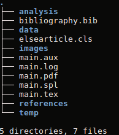

# GenArtigo

Genartigo é um pequeno gerador de templates para elaboração de artigos científicos no padrão para submissão em revistas internacionais.

## Gerando a estrutura do artigo

Após clonar o projeto (git@github.com:nosbielcs/genartigo.git) em seu ambiente de trabalho ou  fazer o download do arquivo compactado (https://github.com/nosbielcs/genartigo/archive/master.zip) e extrair em seu ambiente de trabalho. Execute:

`sh genartigo.sh`

Perceba que dentro do diretório do projeto foi criado um novo diretório chamado **template**. Todos os recursos necessários para iniciar a elaboração do seu artigo estão neste diretório.

## Diretórios do Projeto Padrão

Após gerar o template, todos os arquivos estaro dentro do diretório **template**.
1. analysis - **diretório para armazenar arquivos utilizados em suas análises. Por exemplo: scripts de análises de dados**.
2. data -  **diretório para armazenar os dados utilizados nas análises realizadas**.
3. images - **diretório para armazenar imagens utilizadas no artigo**.
4. references - **diretório para armazenar arquivos digitais consultados durante a escrita do artigo**.
5. temp - **diretório para armazenar arquivos temporários**.
6. main.tex - **arquivo responsável pela escrita do artigo. Por padrão já está estruturado, porém pode ser modificado de acordo com os padrões da revista que você for publicar seu trabalho**.
7. bibliography.bib - **arquivo responsável pelo gerenciamento de bibliografias utilizadas no seu artigo. O padrão adotado foi o bibtex nativo.**
8. elsearticle.cls - **arquivo responsável pelo design base do template**.

## Bibliotecas Latex necessárias

`\usepackage[utf8]{inputenc}` %reconhece acentuacao

`\usepackage[T1]{fontenc}` %padrao de fonte

`\usepackage[brazilian]{babel}` %traduz para o pt-br

`\usepackage{lipsum}` %gera textos aleatorios

`\usepackage{graphicx}` %uso de imagens

`\usepackage{amssymb}` % para exibir simbolos matematicos

`\usepackage{subfig}` %uso de caixa de figuras

`\usepackage{amsmath}` %para usar begin{cases}

`\usepackage{amsfonts}` %para usar mathbb

`\usepackage{float}` %fixa tabela e imagens flutuantes

`\graphicspath{{images/}}` %diretorio onde ficarão imagens

`\usepackage{latexsym}` %permite usar simbolos

`\usepackage{lineno}` %para mostrar numeração de linhas

## Dúvidas

Se persistirem dúvidas, por gentileza me reporte com uma **Issue**. [Clique aqui para relatar um Problema](https://github.com/nosbielcs/genartigo/issues)
